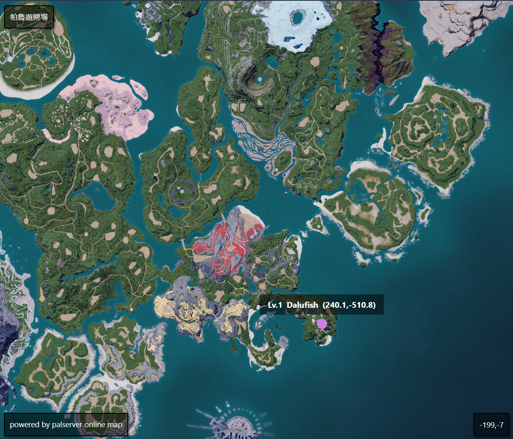

# Palserver Map

Online map for the Palworld Dedicated Server, which displays players' locations, levels, and names.



### How to use

#### Online version

https://palserver-online-map.onrender.com/

(Notice: You can't use online version if your servers are running through vpn or you're trying to access servers through 127.0.0.1)

#### Run locally 

```bash
npm i
```

```bash
node server.js
```

#### Start using the Map

1. Click connect to server button.
2. Enter your Ip address, rest api port and admin password.
3. Have fun!

#### Special Thanks

- Ideas - https://github.com/BloodDragon2580
- Inspire - https://github.com/DecioLuvier/SphereZones
